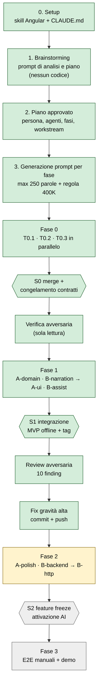
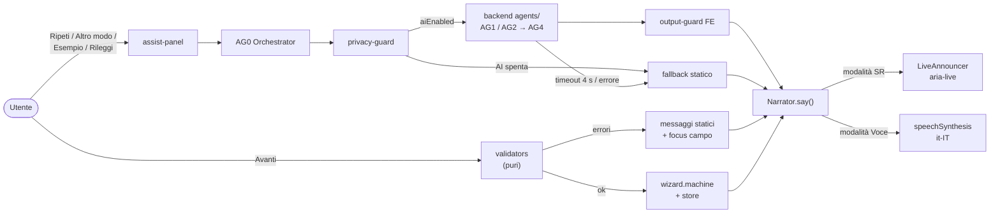
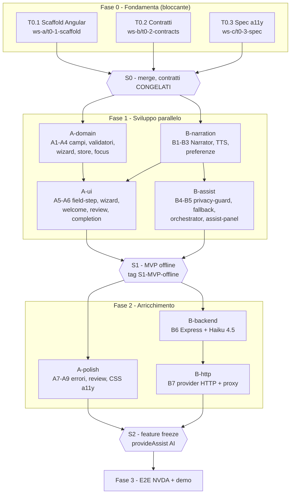
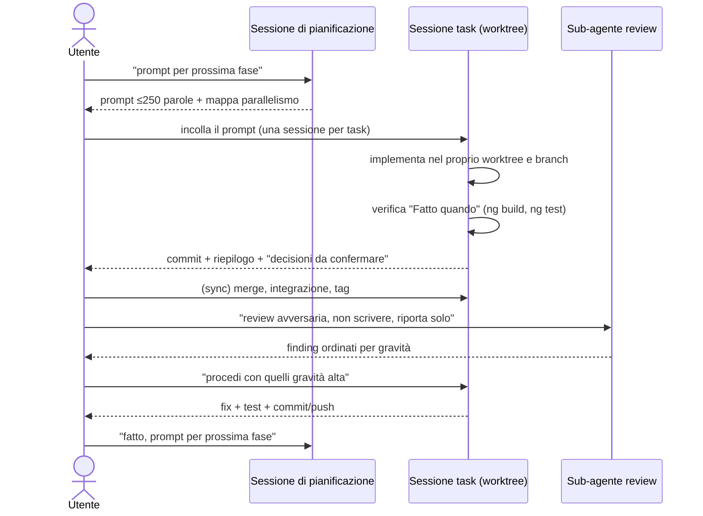

# Percorso del progetto: come è stato avviato e sviluppato

> MVP Angular che guida una persona non vedente nella registrazione online (nome, email, password), un campo alla volta.
> Sviluppo del 5 ottobre 2026 con Claude Code, usando più sessioni agentiche in parallelo.
> Questo documento ricostruisce prompt, decisioni, agenti, flusso di lavoro, limiti incontrati e consigli. Le fonti sono i transcript delle sessioni e la storia git.

---

## 1. Panoramica in un colpo d'occhio



Legenda: verde = completato, giallo = in corso, grigio = da fare (stato al 5/10/2026, ore 14:48).

---

## 2. Cronologia

| Ora (locale) | Passo | Sessione | Esito |
|---|---|---|---|
| 12:00 | Creazione skill/agenti Angular e `CLAUDE.md` | setup | 5 agenti in `.claude/agents/` + convenzioni progetto |
| 12:06 | **Prompt di brainstorming** (analisi e piano, niente codice) | pianificazione | Piano completo in 10 sezioni |
| 12:23 | Richiesta prompt Fase 0 (≤250 parole, regola 400K in memory) | pianificazione | 4 prompt + tabella parallelismo |
| 12:32–12:35 | Avvio T0.1, T0.2, T0.3 in **3 sessioni parallele** | A, B, C | Commit su 3 branch |
| 13:04 | S0: merge + congelamento contratti | sync | `3147eaf` |
| 13:14 | Verifica avversaria del merge (sub-agente, sola lettura) | sync | PASS, 1 finding sulla privacy dei tipi |
| 13:15 | Richiesta prompt Fase 1 | pianificazione | 4 prompt + S1 + mappa di parallelismo |
| 13:18–13:56 | A-domain, B-narration, poi A-ui, B-assist | 4 sessioni | Commit su 4 branch, ogni sessione nel suo worktree |
| 13:56 | S1: integrazione MVP offline | sync | `92b160c`, tag `S1-MVP-offline`, 303 test verdi |
| 14:13 | Review avversaria S1 ("non scrivere, riporta solo") | sync | 10 finding (4 alta, 3 media, 3 bassa) |
| 14:21 | "Procedi con quelli gravità alta" | sync | `94cd188`, 315 test verdi, push con il tag |
| 14:22 | Richiesta prompt Fase 2 | pianificazione | A-polish, B-backend, B-http, S2 |
| 14:43–14:45 | Avvio A-polish e B-backend in parallelo | 2 sessioni | **In corso** (modifiche non ancora committate) |

```mermaid
gantt
    title Sessioni del 5 ottobre 2026
    dateFormat HH:mm
    axisFormat %H:%M
    section Pianificazione
    Skill + CLAUDE.md          :done, 12:00, 6m
    Brainstorming e piano      :done, 12:06, 17m
    Prompt Fase 0/1/2          :done, 12:23, 2m
    section Fase 0
    T0.1 Scaffold              :done, 12:32, 30m
    T0.2 Contratti             :done, 12:33, 12m
    T0.3 Spec a11y             :done, 12:35, 4m
    S0 + verifica              :done, 13:04, 17m
    section Fase 1
    A-domain                   :done, 13:18, 11m
    B-narration                :done, 13:19, 11m
    A-ui                       :done, 13:31, 25m
    B-assist                   :done, 13:31, 20m
    S1 + review + fix          :done, 13:56, 46m
    section Fase 2
    A-polish                   :active, 14:43, 35m
    B-backend                  :active, 14:45, 40m
```



---

## 3. Fase di avvio: skill e convenzioni

Primo prompt: *"Crea skills di sviluppo FE Angular in questo progetto"*.

Risultato:
- **`CLAUDE.md`**: le convenzioni Angular (standalone, OnPush, signals, `inject()`, `input()`/`output()`, `@if`/`@for`, lazy routing, HTTP tipizzato, `takeUntilDestroyed`). Ogni sessione lo carica in automatico, e ogni prompt successivo dice *"Segui CLAUDE.md"*.
- **5 agenti di sviluppo** in `.claude/agents/`:

| Agente | Scopo |
|---|---|
| `angular-component` | Componenti standalone con signals, OnPush, input/output tipizzati |
| `angular-service` | Servizi HTTP e di stato (signals) |
| `angular-feature` | Feature completa: modello, servizi, componenti, routing lazy |
| `angular-test` | Test unitari e di integrazione |
| `angular-review` | Review con checklist: bug, performance, architettura, idiomi 17+ |

Questi agenti sono strumenti di supporto. Il piano non dipende da loro.

---

## 4. Il prompt di brainstorming

Il prompt chiave del progetto. Chiede **solo analisi e piano**, vieta codice, file e comandi, e lascia all'AI il compito di identificare agenti e skill:

```text
Agisci come Software Architect, Accessibility Specialist e Senior Angular Developer.

Obiettivo: progettare un MVP Angular che aiuti una persona non vedente a completare
autonomamente un processo di registrazione online.

La soluzione dovrà:
- accompagnare l'utente un campo alla volta;
- spiegare cosa viene richiesto e perché;
- fornire esempi comprensibili;
- segnalare gli errori chiaramente;
- supportare tastiera e sintesi vocale;
- permettere di chiedere una spiegazione alternativa;
- rispettare privacy e accessibilità;
- includere una demo con nome, email e password.

Non ti fornisco agenti o skill predefiniti: devi identificarli autonomamente.

In questa fase NON sviluppare codice, NON creare file e NON eseguire comandi.

Produci esclusivamente:
1. Analisi della persona e delle barriere principali.
2. Elenco degli agenti e delle skill proposti.
3. Per ogni agente: responsabilità, input, output, limiti e dipendenze.
4. Flusso di collaborazione tra frontend, agenti e funzionalità vocali.
5. Separazione tra logica deterministica e comportamento AI.
6. Architettura Angular proposta e file tree preliminare.
7. Piano di sviluppo organizzato in task piccoli e verificabili.
8. Dipendenze e criteri di completamento per ogni task.
9. Suddivisione in workstream parallelizzabili, evitando conflitti sugli stessi file.
10. Sequenza finale di integrazione e test end-to-end.

Ottimizza il piano per un prototipo sviluppabile in 3 ore da due persone o due istanze agentiche.

Evidenzia:
- task eseguibili in parallelo;
- task bloccanti;
- punti di sincronizzazione;
- rischi e semplificazioni consigliate.

Fermati al termine del piano. Attendi un comando esplicito prima di iniziare qualsiasi implementazione.
```

**Perché funziona:**
- Assegna **tre ruoli** insieme (architettura, accessibilità, sviluppo), così il piano li tiene in equilibrio.
- Elenca un **output numerato**, quindi il piano è completo e confrontabile.
- Pone un **vincolo di tempo e di risorse** (3 ore, 2 istanze), che obbliga a semplificare e a parallelizzare.
- Mette un **blocco esplicito**: niente implementazione finché l'utente non dà il via.

---

## 5. Definizione dei requisiti (esito del brainstorming)

### 5.1 Persona e barriere

- **Lucia, 52 anni, cieca dalla nascita**: NVDA + Chrome, solo tastiera. Sui form complessi chiede aiuto a un familiare e perde autonomia e privacy.
- **Marco**, la variante: ipovedente grave, non usa uno screen reader, gli servono la voce integrata e il contrasto alto.

| Barriera | Soluzione adottata |
|---|---|
| Etichette mancanti o placeholder | `<label>` esplicita e `aria-describedby` |
| Errori solo visivi | `aria-invalid`, annuncio assertive, focus sul campo |
| Regole vaghe | Regole elencate prima; l'errore dice quale regola manca |
| Troppi campi insieme | Un campo per passo, "Passo X di 3" |
| Contenuti dinamici non annunciati | `LiveAnnouncer` del CDK, focus gestito |
| Non si può verificare cosa si è scritto | "Rileggi" lettera per lettera, in locale |
| Validazione durante la digitazione | Validazione solo su "Avanti" |
| Screen reader e voce sovrapposti | Modalità che si escludono, scelte all'avvio |
| Password letta o inviata a terzi | Valori mai fuori dal browser; password letta solo dopo conferma |

### 5.2 Requisiti non negoziabili (privacy e deterministico prima dell'AI)

1. All'AI arrivano **solo metadati** del campo, codici di errore e domande ripulite. **Mai valori digitati.**
2. La chiave API sta solo nel backend `agents/.env`.
3. `localStorage` contiene solo le preferenze (`a11y-prefs`: modalità, velocità).
4. Il riconoscimento vocale è spento di default e sempre disattivato sul campo password.
5. Con `aiEnabled=false` la demo funziona al 100%.
6. **L'AI produce solo testo da leggere**: non cambia mai valori, validità, navigazione o invio.

| Funzione | Deterministica | AI |
|---|---|---|
| Navigazione, validazione, codici di errore | ✅ | ❌ |
| Focus, aria-*, annunci, TTS, spell-out | ✅ | ❌ |
| Spiegazione principale ed esempio | ✅ catalogo statico | ❌ |
| "Spiega in altro modo" | riserva statica a rotazione | ✅ |
| Domanda libera | riserva "non ho capito…" | ✅ (stretch) |
| Controllo dell'output AI | ✅ output-guard | ❌ |

### 5.3 Specifica di interazione (T0.3, `docs/a11y-test-script.md`)

10 regole: un campo per passo, validazione solo su Avanti, ordine fisso dei pulsanti (Ripeti, Spiega in altro modo, Esempio, Rileggi, Indietro, Avanti), nessuna scorciatoia a lettera singola, modalità SR/Voce che si escludono, focus sul titolo all'ingresso del passo, focus sul campo e annuncio assertive in caso di errore, password mai letta senza conferma, nessun valore all'AI o in storage, ogni comando interrompe la voce.
Il file contiene anche i testi esatti degli annunci e la checklist E2E **E2-1…E2-9**.

---

## 6. Gli agenti

Nel progetto "agente" ha tre significati diversi.

### 6.1 Agenti runtime (nel prodotto)

| ID | Agente | Tipo | Ruolo |
|---|---|---|---|
| AG0 | Assist Orchestrator | Deterministico (Angular) | Sceglie la fonte (statico o AI), applica privacy-guard, timeout di 4 s e fallback |
| AG1 | Guida Campo (Field Explainer) | AI (Claude Haiku 4.5) con riserva statica | `explain`, `rephrase`, `example` |
| AG2 | Coach Errori (Error Coach) | Statico, AI facoltativa | Traduce i codici di errore in consigli |
| AG3 | Interprete Domande | AI, stretch | Domanda libera → intent chiuso |
| AG4 | Guardiano Output (Output Guard) | Deterministico, su frontend e backend | Testo non vuoto, ≤300 caratteri, niente URL né email |



### 6.2 Agenti di sviluppo (le sessioni Claude Code)

Ogni task è stato eseguito da una **sessione dedicata**, con un ruolo nel prompt:

| Sessione | Ruolo assegnato | Workstream |
|---|---|---|
| T0.1 Scaffold | Senior Angular Dev + A11y Specialist | A (Frontend & A11y) |
| T0.2 Contratti | Software Architect + Senior TS Dev | B (Voce & AI) |
| T0.3 Spec | Accessibility Specialist (WCAG 2.2, NVDA) | C |
| A-domain, A-ui, A-polish | Senior Angular Dev (+ A11y) | A |
| B-narration | Angular Dev + specialista Web Speech API | B |
| B-assist | Angular Dev + specialista privacy e AI safety | B |
| B-backend | Senior Node.js Dev + AI Safety Engineer | B |
| S0, S1, S2 | Software Architect (integrazione) | sync |

### 6.3 Sub-agenti di verifica

Dopo ogni punto di sincronizzazione è stata lanciata una **review avversaria**: un sub-agente indipendente, **senza il contesto della sessione** (quindi senza i suoi bias), in **sola lettura**. Riporta l'esito e non committa. Le correzioni vengono decise dall'utente.

---

## 7. Flusso di lavoro

### 7.1 Fasi, workstream e punti di sincronizzazione



### 7.2 Proprietà dei file: zero conflitti per costruzione

| Area | Owner esclusivo |
|---|---|
| `core/contracts/**`, `agents/src/contract.ts` | Insieme fino a S0, poi **congelati** |
| `app.config.ts`, `app.routes.ts`, `package.json`, `styles.scss`, `features/registration/**`, `core/a11y/**` | A |
| `core/narration/**`, `core/assist/**`, `assist-panel`, `voice-settings`, `agents/**`, `proxy.conf.json` | B |
| `docs/a11y-test-script.md` | C / B |

Ogni prompt contiene una sezione **"NON toccare"** con le aree degli altri workstream. Risultato: i merge di S0 e S1 sono passati **senza conflitti**.

### 7.3 Il ciclo standard di ogni task



### 7.4 Struttura dei prompt di task

Tutti i prompt seguono lo stesso schema (massimo 250 parole circa):

```text
Ruolo: <uno o più ruoli specialistici>. Segui CLAUDE.md.
Progetto: <una riga di contesto>.
Task <ID> – <nome> (Fase N, bloccante?). Branch: <ws-x/nome>.
Prerequisiti: <branch/task che devono essere completati>.

Fai / Task:
1. <passi concreti, file e percorsi esatti, nomi dei tipi>
...

NON toccare: <aree degli altri workstream>.
Fatto quando: <criteri verificabili: ng build/test verdi, scenari E2-x>. Committa.

Regola 400K: se superi 400K token, scrivi docs/handoff/<ID>.md, committa e avvia
una nuova sessione da quel file. Se non puoi, fornisci il prompt di ripresa.
```

Tutti i prompt eseguiti sono nell'[Appendice A](#appendice-a--prompt-eseguiti).

---

## 8. Risultati per fase

| Fase | Branch | Commit | Contenuto | Test |
|---|---|---|---|---|
| T0.1 | `ws-a/t0-1-scaffold` | `945752a` | Angular 19, Jest, CDK, skip-link, `lang="it"`, focus visibile, forced-colors | 3 |
| T0.2 | `ws-b/t0-2-contracts` | `73b22d6` | `ValidationErrorCode`, `FieldDefinition`, `AssistRequest` (union per skill), `Narrator` | `tsc --strict` |
| T0.3 | `ws-c/t0-3-spec` | `ef3c48b` | `docs/a11y-test-script.md` | – |
| S0 | `main` | `3147eaf` | Merge, marker "CONGELATO dopo S0" | build e test verdi |
| A-domain | `ws-a/a-domain` | `dcead85` | Campi, 3 validatori puri (49 casi), wizard machine, store a signals, focus | 82 |
| B-narration | `ws-b/b-narration` | `cbd70d8` | `NarrationService` SR/Voce, TTS it-IT, preferenze, `voice-settings` | 39 |
| A-ui | `ws-a/a-ui` | `d663576` | field-step, wizard, welcome, progress, review, completion, jest-axe | 147 |
| B-assist | `ws-b/b-assist` | `8f11a03` | privacy-guard, fallback a rotazione, output-guard, orchestratore, assist-panel | 192 |
| **S1** | `main` | `92b160c` → `94cd188` | **MVP offline**, tag `S1-MVP-offline`, fix gravità alta, push | **315** |
| A-polish | `ws-a/a-polish` | in corso | A7 errori accessibili, A8 review/completion, A9 CSS | – |
| B-backend | `ws-b/b-backend` | in corso | Express, `POST /api/assist`, agenti Haiku 4.5, output-guard | – |

### Le review avversarie

**S0:** tutto PASS. Unico finding: la regola "nessun valore all'AI" è garantita **solo da commenti**, non dal type system (`previousText`, `question`, `example` sono `string` semplici).

**S1:** 10 finding.

| Gravità | Problema | Stato |
|---|---|---|
| Alta | Errori vecchi riannunciati tornando su un campo | ✅ corretto |
| Alta | Indietro non usciva dalla modalità Modifica | ✅ corretto |
| Alta | Password letta restava in memoria (`repeatLast`, regione live) | ✅ corretto (`saySensitive`, svuotamento dopo 3 s) |
| Alta | Invio fallito senza avviso | ✅ corretto |
| Media | Domande con "avanti" scambiate per comandi | aperto |
| Media | Microfono bloccato se l'avvio fallisce | aperto |
| Media | L'orchestratore può smettere di rispondere con richiesta malformata | aperto |
| Bassa | "Passo N di M" annunciato due volte (contro E2-1) | aperto |
| Bassa | Testi di errore duplicati in due file | aperto |
| Bassa | Pulizia del microfono duplicata, codice superfluo | aperto |

---

## 9. Limiti e problemi incontrati

### Ambiente
- **Node 20.18.2 → Angular 19**: Angular 20 e successive richiedono Node ≥ 20.19.
- **Registry npm aziendale** (Nexus) irraggiungibile senza VPN. Soluzione: `npm_config_registry=https://registry.npmjs.org` per ogni comando, senza committare `.npmrc`.
- `npx tsc` non disponibile: TypeScript è stato installato nello scratchpad, fuori dal progetto.

### Sessioni parallele
- **Working tree condiviso**: in Fase 0 le tre sessioni lavoravano nella stessa cartella. Una ha fatto `git checkout` e il commit di T0.1 è finito sul branch di T0.3 (poi copiato con cherry-pick). Dalla Fase 1 ogni sessione usa il suo `git worktree`, con `node_modules` collegato tramite junction.
- I worktree hanno una **cartella memory diversa**, quindi le regole generiche vanno ripetute nei prompt.
- Una sessione **non può aprirne un'altra interattiva**: la regola dei 400K prevede che venga dato il prompt di ripresa.
- Il conteggio dei token è **stimato**, non misurato: i 400K sono una soglia indicativa. Nessuna sessione l'ha raggiunta (massimo ~150K).

### Allineamento tra artefatti paralleli
I tre documenti di Fase 0 sono stati scritti insieme, senza vedersi a vicenda, e alcune scelte non coincidono:
- codici di errore della spec (`NAME_REQUIRED`, `PASSWORD_WEAK`) diversi da quelli del contratto (`REQUIRED`, `PASSWORD_MISSING_*`);
- timeout dell'AI: 3 s nella spec, 4 s nei prompt;
- firma di `provideAssist`: il prompt S1 diceva `'fallback'`, l'implementazione riceve l'elenco dei campi.

Le sessioni hanno seguito il contratto congelato e hanno segnalato le differenze come "decisioni da confermare".

### Verifica
- **Nessun test reale con NVDA** finora: E2-1, E2-2 ed E2-7 sono coperti da test automatici, ma la verifica manuale con screen reader e DevTools è ancora da fare.
- Alcune scelte (es. 3 s prima di svuotare la regione live) vanno validate con uno screen reader reale.
- La privacy nei contratti è una convenzione più controlli a runtime (privacy-guard), non un vincolo di tipo.

---

## 10. Consigli e indicazioni

### Per il prompting
1. **Separare piano e implementazione.** Il primo prompt vieta codice, file e comandi e finisce con "attendi un comando esplicito".
2. **Chiedere output numerati e completi**: persona, agenti, contratti, task con "Fatto quando", workstream, rischi.
3. **Dare vincoli di tempo e risorse** (3 ore, 2 istanze): ottengono piani realistici e semplificazioni.
4. **Prompt di task brevi** (≤250 parole) con schema fisso: Ruolo · Progetto · Task · Branch · Prerequisiti · Fai · NON toccare · Fatto quando · Regola 400K.
5. **Criteri di completamento verificabili** (`ng build`/`ng test` verdi, scenari E2-x) invece di "fai bene".
6. **Una sessione di pianificazione "regista"** che genera i prompt fase per fase, adattandoli a quello che è successo nelle fasi precedenti.

### Per il lavoro parallelo
7. **Un `git worktree` per sessione fin dall'inizio**, e controllo del branch (`git rev-parse --abbrev-ref HEAD`) prima di ogni commit.
8. **Proprietà esclusiva dei file per workstream** e sezione "NON toccare" in ogni prompt: merge senza conflitti.
9. **Contratti condivisi prima di tutto, poi congelati** (S0). Le modifiche si propongono solo al punto di sincronizzazione successivo.
10. **Allineare spec e contratti dentro S0**: è il momento meno costoso per sistemare codici di errore, timeout e firme.

### Per la qualità
11. **Review avversaria dopo ogni sync**, con un sub-agente senza contesto, in sola lettura, con finding ordinati per gravità. Si corregge prima l'alta gravità.
12. **Deterministico prima dell'AI**: la demo deve funzionare al 100% offline (S1). L'AI aggiunge valore ma non è un rischio per la demo.
13. **Privacy come requisito architetturale**: nessun valore nei contratti verso l'AI, guard su ingresso e uscita, storage solo per le preferenze.
14. **Testare presto con NVDA reale**: installarlo prima di iniziare e prevedere test manuali già da S1.
15. **Leggere le "decisioni da confermare"** nei riepiloghi delle sessioni: è lì che emergono le divergenze tra i workstream.

### Gestione del contesto
16. **Regola 400K** salvata in memory e ripetuta nei prompt: oltre la soglia, la sessione scrive `docs/handoff/<ID>.md` (stato, file, decisioni, prossimi passi, comandi di verifica), committa e riparte da una nuova sessione.

---

## 11. Prossimi passi

1. Completare **A-polish** e **B-backend** (in corso), poi **B-http** (provider HTTP + `proxy.conf.json`).
2. **S2**: merge `b-backend → b-http → a-polish`, `provideAssist` con AI, verifica di E2-4, E2-5 ed E2-7 con backend acceso e spento, tag `S2-feature-freeze`.
3. Valutare i 6 finding aperti della review S1, in particolare il n. 8 (annuncio doppio di "Passo N di M").
4. **Fase 3**: checklist E2-1…E2-9 con NVDA, axe, zoom 200%, forced-colors; script della demo da 3 minuti, prima con l'AI accesa e poi con il backend spento.

---

## Appendice A — Prompt eseguiti

<details>
<summary>Richieste alla sessione di pianificazione</summary>

```text
Scrivi prompt per fase 0, massimo 250 parole, nel prompt indica che se si superano 400K token
in sessione, avviare in autonomia nuova sessione con handoff (sarà regola generica da scrivere
in memory). Indicami successivamente quali sono parallelizzabili. Lavoreremo a sessioni dedicate
```
```text
fatto, prompt per prossima/e fase/i
```
```text
fatto, indica i prossimi passi
```
```text
fase 0 completata. avviamo prompt per fase 2
```
Durante le sync:
```text
avvia verifica avversaria ora che è mergiato
la revisione non deve committare, solo riportare eventuali
```
```text
avvia review avversaria, non scrivere, riporta solo esito
procedi con quelli gravità alta
```
</details>

<details>
<summary>T0.1 — Scaffold</summary>

```text
Ruolo: Senior Angular Developer e Accessibility Specialist.
Progetto: MVP Angular che guida una persona non vedente nella registrazione online (nome, email, password), un campo alla volta. Segui CLAUDE.md.

Task T0.1 – Scaffold (Fase 0, bloccante). Branch: ws-a/t0-1-scaffold.

Fai:
1. In app/ crea l'app Angular: standalone, SCSS, routing, niente SSR. Sostituisci Karma con Jest.
2. Aggiungi @angular/cdk.
3. index.html: lang="it", title "Registrazione guidata".
4. AppComponent (OnPush): skip-link "Vai al contenuto" verso <main id="main" tabindex="-1">, poi <router-outlet>.
5. styles.scss: classe .sr-only, :focus-visible ben visibile e ad alto contrasto, regole @media (forced-colors: active).
6. app.routes.ts con la route lazy "registration" (loadChildren) verso features/registration/registration.routes.ts, che per ora contiene un array vuoto. Redirect da "" a "registration".

NON creare né modificare: core/contracts/**, core/narration/**, core/assist/**, agents/, docs/. Li gestiscono sessioni parallele.

Fatto quando:
- ng build e ng test sono verdi, con un test di AppComponent che verifica skip-link e <main>;
- ng serve parte senza errori.
Committa con un messaggio descrittivo. Non andare oltre T0.1.

Regola di contesto: se la sessione supera 400K token, fermati a un punto stabile, scrivi docs/handoff/T0.1.md (stato, file toccati, decisioni, prossimi passi, comandi di verifica), committa e avvia una nuova sessione che riparta da quel file. Se non puoi avviarla, dammi il prompt esatto di ripresa. Salva questa regola in memory come regola generica, se non c'è già.
```
</details>

<details>
<summary>T0.2 — Contratti condivisi</summary>

```text
Ruolo: Software Architect e Senior TypeScript Developer.
Progetto: MVP Angular che guida una persona non vedente nella registrazione (nome, email, password), un campo alla volta. Segui CLAUDE.md.

Task T0.2 – Contratti condivisi (Fase 0, bloccante). Branch: ws-b/t0-2-contracts.
Scrivi solo tipi, niente logica. Aggiungi un JSDoc breve con la regola di privacy: i valori digitati non entrano mai nei contratti verso l'AI.

Crea in app/src/app/core/contracts/:
- validation.model.ts: union ValidationErrorCode (REQUIRED, NAME_TOO_SHORT, NAME_INVALID_CHARS, EMAIL_MISSING_AT, EMAIL_INVALID_DOMAIN, EMAIL_INVALID_FORMAT, PASSWORD_TOO_SHORT, PASSWORD_MISSING_UPPER, PASSWORD_MISSING_LOWER, PASSWORD_MISSING_DIGIT, PASSWORD_MISSING_SYMBOL) e ValidationResult.
- field-definition.model.ts: FieldId ('name'|'email'|'password') e FieldDefinition (id, label, inputType, autocomplete, purpose, why, example, rules, alternativeExplanations, errorMessages per codice).
- assist.contract.ts: AssistSkill (explain|rephrase|example|error-hint|question), ExplanationStyle, AssistFieldContext (solo metadati, nessun valore), AssistRequest, AssistResponse {text, source: 'ai'|'fallback', intent?}, AssistIntent.
- narrator.port.ts: abstract class Narrator con say(text, politeness 'polite'|'assertive'), stop(), repeatLast().
- index.ts (barrel).
Poi crea agents/src/contract.ts, copia identica dei tipi di assist, con il commento "tenere sincronizzato".

NON toccare altri file. L'app Angular viene creata in parallelo.
Fatto quando: npx tsc --strict --noEmit sui file creati passa. Committa.

Regola di contesto: se la sessione supera 400K token, scrivi docs/handoff/T0.2.md (stato, file, decisioni, prossimi passi, verifiche), committa e avvia una nuova sessione da quel file. Se non puoi, dammi il prompt di ripresa. Salva la regola in memory se manca.
```
</details>

<details>
<summary>T0.3 — Specifica di interazione</summary>

```text
Ruolo: Accessibility Specialist (WCAG 2.2, NVDA, sintesi vocale).
Progetto: MVP Angular che guida una persona non vedente nella registrazione (nome, email, password), un campo alla volta. Segui CLAUDE.md.

Task T0.3 – Specifica di interazione (Fase 0). Branch: ws-c/t0-3-spec.
Crea solo docs/a11y-test-script.md, in italiano, con tre sezioni.

1. Regole di interazione (al massimo 10):
- un campo per passo;
- validazione solo quando si preme "Avanti";
- pulsanti in quest'ordine: Ripeti, Spiega in altro modo, Esempio, Rileggi cosa ho scritto, Indietro, Avanti;
- nessuna scorciatoia a lettera singola;
- modalità Screen reader (aria-live) e Voce integrata (TTS) che si escludono, scelte nella welcome; il pulsante "Inizia" vale come gesto utente;
- all'ingresso di un passo il focus va sul titolo;
- in caso di errore: focus sul campo e annuncio assertive;
- la password non viene mai letta senza conferma;
- nessun valore inviato all'AI o salvato in storage.

2. Testi esatti degli annunci, con segnaposto: ingresso nel passo, errori per ciascun codice, cambio modalità, riepilogo, conferma finale.

3. Checklist E2E, scenari E2-1…E2-9: percorso felice con NVDA; email senza @; password debole; "Spiega in altro modo" ×3 anche con backend spento; interruzione della voce; rilettura lettera per lettera; payload e storage privi di valori; Indietro e Modifica; axe, zoom 200%, forced-colors. Per ognuno indica passi e risultato atteso.

Fatto quando: il file esiste, è conciso e si può usare durante i test. Committa.

Regola di contesto: se la sessione supera 400K token, scrivi docs/handoff/T0.3.md, committa e avvia una nuova sessione da quel file. Se non puoi, dammi il prompt di ripresa. Salva la regola in memory se manca.
```
</details>

<details>
<summary>S0 — Sincronizzazione Fase 0</summary>

```text
Ruolo: Software Architect. Segui CLAUDE.md.
Task S0 – Sincronizzazione della Fase 0.
1. Fai il merge su main, in quest'ordine: ws-a/t0-1-scaffold, ws-b/t0-2-contracts, ws-c/t0-3-spec.
2. Verifica che ng build e ng test in app/ siano verdi e che i contratti compilino dentro l'app.
3. Controlla che i contratti rispettino la privacy (nessun campo "value" verso l'AI) e che agents/src/contract.ts sia allineato.
4. Aggiungi in testa ai file di core/contracts/ il commento "CONGELATO dopo S0".
Committa. Non iniziare la Fase 1.
Regola di contesto: oltre 400K token, handoff in docs/handoff/S0.md e nuova sessione.
```
</details>

<details>
<summary>A-domain — A1-A4</summary>

```text
Ruolo: Senior Angular Developer. Segui CLAUDE.md.
Progetto: MVP Angular per registrazione guidata accessibile (nome, email, password, un campo per passo).
Prerequisiti: T0.1 e T0.2 completati e mergiati su main. Branch: ws-a/a-domain.

Task A1 — registration-fields.ts
In app/src/app/features/registration/data/registration-fields.ts definisci un array FieldDefinition[] per i campi name, email, password. Ogni campo ha: id, label, inputType, autocomplete, purpose, why, example, regole (array di stringhe leggibili), almeno 2 alternativeExplanations (stili diversi), errorMessages (dizionario ValidationErrorCode→stringa statica chiara).

Task A2 — validators.ts
In app/src/app/features/registration/domain/validators.ts scrivi funzioni pure: validateName, validateEmail, validatePassword. Restituiscono ValidationResult. Test Jest (≥15 casi): accenti, apostrofo (D'Angelo), spazi, email senza @, password debole.

Task A3 — wizard.machine.ts + registration.store.ts
wizard.machine.ts: tipo WizardStep, funzioni pure nextStep/prevStep/canAdvance.
registration.store.ts: signals Angular (values, errors, currentStep, submitted). Nessun BehaviorSubject. Test: avanti bloccato con errori, indietro preserva valori, invio mock.

Task A4 — focus.service.ts
In core/a11y/focus.service.ts: metodo focusStep(el: HTMLElement) che chiama el.focus(). Injectable con inject(). Test unitario.

NON toccare: core/narration/**, core/assist/**, ui/assist-panel, agents/.
Fatto quando: ng test verde su tutti i file creati. Committa.

Regola 400K: se superi 400K token, scrivi docs/handoff/A-domain.md, committa e avvia nuova sessione da quel file. Se non puoi, fornisci il prompt di ripresa.
```
</details>

<details>
<summary>B-narration — B1-B3</summary>

```text
Ruolo: Senior Angular Developer, specialista accessibilità e Web Speech API. Segui CLAUDE.md.
Progetto: MVP Angular per registrazione guidata accessibile. Branch: ws-b/b-narration.
Prerequisiti: T0.1 e T0.2 completati su main.

Task B1 — narration.service.ts (⚠ pubblica entro 0:40)
In core/narration/narration.service.ts implementa la abstract class Narrator (dal contratto): say(text, politeness) instrada a LiveAnnouncer (modalità SR) o SpeechSynthesisService (modalità Voce); stop(); repeatLast(). Un solo canale attivo alla volta. Usa CdkA11yModule e inject().

Task B2 — speech-synthesis.service.ts
Attende voiceschanged prima di selezionare la voce it-IT (fallback: prima voce disponibile). cancel() prima di ogni nuova frase. Signal speaking. Metodo speak(text), stop(). Test con speechSynthesis mockato.

Task B3 — speech-preferences.store.ts + voice-settings (componente stub)
Store signals: mode ('sr'|'voice'), rate (0.8–1.2), voiceUri. Persiste solo mode e rate in localStorage (chiave 'a11y-prefs'), mai valori del form. voice-settings: componente standalone OnPush con <fieldset> per scegliere modalità e velocità. Aggiorna lo store.

Esponi provideNarration() in core/narration/provide-narration.ts.
NON toccare: features/registration/**, core/assist/**, agents/.
Fatto quando: ng test verde. Committa.

Regola 400K: docs/handoff/B-narration.md, committa, nuova sessione. Se non puoi, prompt di ripresa.
```
</details>

<details>
<summary>A-ui — A5-A6</summary>

```text
Ruolo: Senior Angular Developer e Accessibility Specialist. Segui CLAUDE.md.
Progetto: MVP Angular registrazione guidata. Branch: ws-a/a-ui.
Prerequisiti: ws-a/a-domain e ws-b/b-narration mergiati su main (o disponibili come branch base).

Task A5 — field-step (componente standalone OnPush)
In features/registration/ui/field-step: <label> collegata all'input, aria-describedby verso il testo d'aiuto e le regole, aria-invalid e aria-errormessage quando ci sono errori. Input type adeguato per ogni campo (text/email/password). Pulsante mostra/nascondi password con aria-label che cambia. Slot <ng-content> per assist-panel (stub con div vuoto se non ancora disponibile). Completamente navigabile da tastiera. Nessuna validazione durante la digitatura.
Test: axe-core via jest-axe, tab order corretto, aria-invalid su errore.

Task A6 — shell del wizard
registration-wizard (OnPush): usa registration.store, wizard.machine, focus.service; al cambio passo chiama focusStep sul titolo h1. progress-indicator: "Passo N di 3" con aria-live="polite". welcome (OnPush): pulsante "Inizia" (gesto utente), include voice-settings. review-step: valori (password mascherata), link "Modifica" per ogni campo. completion: schermata di conferma, focus sul titolo. registration.routes.ts con lazy routing.
Test: percorso completo da tastiera senza AI, con NarrationService stubbed.

NON toccare: core/narration/**, core/assist/**, agents/.
Fatto quando: ng test verde, ng serve parte, percorso felice navigabile da tastiera. Committa.

Regola 400K: docs/handoff/A-ui.md, committa, nuova sessione o prompt di ripresa.
```
</details>

<details>
<summary>B-assist — B4-B5</summary>

```text
Ruolo: Senior Angular Developer, specialista privacy e AI safety. Segui CLAUDE.md.
Progetto: MVP Angular registrazione guidata. Branch: ws-b/b-assist.
Prerequisiti: ws-b/b-narration su main o come branch base.

Task B4 — privacy-guard + fallback-assist.provider.ts
privacy-guard.ts (funzione pura): riceve AssistRequest, verifica che non contenga valori (nessun campo "value"), rimuove con regex indirizzi email e sequenze simili a password. Lancia se trova dati sensibili.
fallback-assist.provider.ts: implementa AssistProvider. Per skill "rephrase" ruota le alternativeExplanations evitando ripetizioni nella stessa sessione. Per "explain" e "example" usa i testi statici di FieldDefinition. Per "error-hint" usa errorMessages. Mai testo vuoto.
Test: payload in uscita senza valori; rotazione senza ripetizioni; ogni codice di errore restituisce testo.

Task B5 — assist-orchestrator + output-guard (frontend) + assist-panel
output-guard.ts (funzione pura): testo non vuoto, solo caratteri stampabili, nessun URL, nessuna email nel testo AI, lunghezza ≤300 caratteri.
assist-orchestrator.service.ts: riceve AssistRequest, chiama il provider HTTP (se disponibile e aiEnabled=true) con timeout 4 s, in caso di errore/timeout usa fallback. Passa sempre per privacy-guard prima dell'invio e per output-guard dopo la risposta.
assist-panel (standalone OnPush): pulsanti Ripeti, Spiega in altro modo, Esempio, Rileggi cosa ho scritto (spell-out locale: "chiocciola" per @, "punto" per ., "trattino basso" per _). Disabilitato il riconoscimento vocale sul campo password.
Esponi provideAssist(fallback) in core/assist/provide-assist.ts.

NON toccare: features/registration/**, core/narration/**, agents/.
Fatto quando: ng test verde. Committa.

Regola 400K: docs/handoff/B-assist.md, committa, nuova sessione o prompt di ripresa.
```
</details>

<details>
<summary>S1 — Integrazione MVP offline</summary>

```text
Ruolo: Software Architect e Senior Angular Developer. Segui CLAUDE.md.
Progetto: MVP Angular registrazione guidata. Branch: main.
Prerequisiti: ws-a/a-domain, ws-a/a-ui, ws-b/b-narration, ws-b/b-assist tutti committati.

Obiettivo: demo offline funzionante al 100% senza AI.

Passi:
1. Merge in ordine: ws-b/b-narration → ws-b/b-assist → ws-a/a-domain → ws-a/a-ui. Risolvi eventuali conflitti (i file non si sovrappongono per design).
2. In app/src/app/app.config.ts aggiungi provideNarration() e provideAssist('fallback'). Importa i moduli CDK necessari.
3. In features/registration/ui/field-step inserisci <app-assist-panel> nello slot. In ui/welcome inserisci <app-voice-settings>.
4. Verifica: ng build --configuration production senza errori. ng test verde su tutti i file.
5. Prova manuale: percorso completo nome → email → password → riepilogo → invio. Con NVDA (o senza, da tastiera): ogni passo annunciato, errori annunciati assertive, focus corretto, pulsanti assist funzionanti con testi statici. Storage: solo chiave a11y-prefs, nessun valore del form.
6. Se un test fallisce o il focus è sbagliato, correggilo prima di committare.

Fatto quando: ng build e ng test verdi; checklist E2-1, E2-2, E2-7 di docs/a11y-test-script.md superate.
Committa con tag "S1-MVP-offline".

Regola 400K: docs/handoff/S1.md, committa, nuova sessione o prompt di ripresa.
```
</details>

<details>
<summary>A-polish — A7-A9 (in corso)</summary>

```text
Ruolo: Senior Angular Developer e Accessibility Specialist. Segui CLAUDE.md.
Progetto: MVP Angular registrazione guidata. Branch: ws-a/a-polish.
Prerequisito: S1 completato e mergiato su main.

Task A7 — Gestione errori accessibile
In field-step: dopo la validazione (pulsante Avanti), se ci sono errori chiama Narrator.say(messaggio, 'assertive'); sposta il focus sull'input con errore; imposta aria-invalid. Se ci sono più errori leggi prima il conteggio ("2 errori trovati"), poi il primo. Non leggere durante la digitatura.
Test: scenario E2-2 (email senza @) e E2-3 (password debole) della checklist.

Task A8 — Review-step e completion finali
review-step: mostra i valori di tutti i campi; la password è mascherata con "••••••••"; ogni campo ha un link "Modifica" che torna al passo corretto e sposta il focus sull'input. Pulsante "Invia" che chiama il mock (Promise che risolve dopo 500 ms).
completion: schermata "Registrazione completata", focus sul titolo h1, Narrator.say del messaggio di conferma.
Test: Modifica → focus sul campo; Invia → completion con focus.

Task A9 — CSS accessibilità
styles.scss: :focus-visible con outline 3px e offset 2px, colori ad alto contrasto. @media (forced-colors: active): nessun elemento invisibile, no background-image decorative. Zoom 200%: nessun testo tagliato, nessun overflow orizzontale.
Test: prova manuale con zoom browser e Windows High Contrast.

NON toccare: core/narration/**, core/assist/**, agents/.
Fatto quando: ng test verde; E2-2, E2-3, E2-8, E2-9 superati. Committa.

Regola 400K: docs/handoff/A-polish.md, committa, nuova sessione o prompt di ripresa.
```
</details>

<details>
<summary>B-backend — B6 (in corso)</summary>

```text
Ruolo: Senior Node.js Developer e AI Safety Engineer. Segui CLAUDE.md.
Progetto: backend per registrazione guidata accessibile. Branch: ws-b/b-backend.
Prerequisito: T0.2 completato (contratti disponibili).

Crea agents/ da zero:
- package.json: express, @anthropic-ai/sdk, dotenv, typescript, ts-node, @types/express.
- tsconfig.json (target ES2022, module NodeNext).
- .env.example: ANTHROPIC_API_KEY=, PORT=3001, AI_ENABLED=true.
- src/contract.ts: copia di assist.contract.ts del frontend, con commento "tenere sincronizzato con app/src/app/core/contracts/assist.contract.ts".
- src/guards/output-guard.ts: funzione pura; testo non vuoto, solo printabili, niente URL, niente pattern email, ≤300 caratteri. Restituisce testo approvato o lancia.
- src/agents/field-explainer.agent.ts: chiama claude-haiku-4-5-20251001, sistema in italiano, max_tokens 120, prompt per skill explain/rephrase/example. Mai chiedere o rivelare valori.
- src/agents/error-coach.agent.ts: skill error-hint, prompt che traduce codici di errore in consigli leggibili. Mai il valore del campo.
- src/orchestrator.ts: dispatch per skill → agent corretto → output-guard. Se AI_ENABLED=false restituisce { text: '', source: 'fallback' }.
- src/server.ts: Express, POST /api/assist valida AssistRequest (zod o check manuale), chiama orchestrator, timeout interno 4 s, gestione errori → 503 senza chiave o con AI_ENABLED=false; GET /health → { ok: true }.

Fatto quando: curl POST /api/assist con skill "explain" restituisce AssistResponse valido; senza chiave → 503. Committa.

Regola 400K: docs/handoff/B-backend.md, committa, nuova sessione o prompt di ripresa.
```
</details>

I prompt **B-http** e **S2** sono già pronti nella sessione di pianificazione, ma non sono ancora stati eseguiti.
